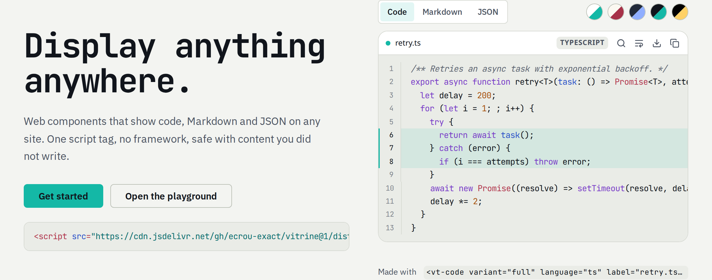

<p align="center">
  <picture>
    <source media="(prefers-color-scheme: dark)" srcset="brand/logo-horizontal-dark.svg">
    
  </picture>
</p>

<p align="center">
  Drop-in web components to display code, Markdown and JSON beautifully — on any website, with zero framework.
</p>

<p align="center">
  <a href="https://github.com/ecrou-exact/vitrine/actions/workflows/ci.yml"></a>
  <a href="LICENSE"></a>
  <a href="https://ecrou-exact.github.io/vitrine/"></a>
</p>

<p align="center">
  <a href="https://ecrou-exact.github.io/vitrine/">Website</a> &nbsp;|&nbsp;
  <a href="https://ecrou-exact.github.io/vitrine/examples.html">Examples</a> &nbsp;|&nbsp;
  <a href="https://ecrou-exact.github.io/vitrine/playground.html">Playground</a> &nbsp;|&nbsp;
  <a href="docs/getting-started.md">Documentation</a>
</p>

<picture>
  <source media="(prefers-color-scheme: dark)" srcset="docs/assets/preview-dark.png">
  
</picture>

> **Status:** pre-release. The three components are implemented and tested; the API may still change before 1.0.

## Features

- **`<vt-code>`** — syntax highlighting for 190+ languages (common ones bundled, the rest loaded on demand), line numbers, highlighted lines, diffs, wrap, collapse, search, copy and download.
- **`<vt-markdown>`** — sanitized GitHub Flavored Markdown, Preview / Source / Split tabs, table of contents, heading anchors, image and link policies.
- **`<vt-json>`** — pretty printing or a collapsible tree, JSONPath copy, search inside collapsed nodes, exact big numbers, precise syntax errors.
- **Simple and full variants**, and every feature can be switched on or off with one attribute.
- **Secure by default** — sanitized output, no `eval`, size, depth and time limits, strict CSP and Trusted Types support. Tested against an XSS payload suite in three browsers.
- **Themable** — five built-in themes (all WCAG AA), CSS custom properties, `::part()` selectors and custom themes.
- **Accessible** — keyboard tabs and trees, labelled controls, screen reader announcements, reduced motion.
- **Works everywhere** — plain HTML, PHP, WordPress, Django, Vue, React, Svelte, Angular. Consumers never need Node.js.

## Quick start

### CDN (classic script)

```html
<script src="https://cdn.jsdelivr.net/gh/ecrou-exact/vitrine@1/dist/vitrine.min.js"
        integrity="sha384-…" crossorigin="anonymous"></script>

<vt-code language="python" line-numbers>
def hello(name):
    return f"Hello {name}"
</vt-code>
```

The exact `integrity` value of each release is published in its [release notes](https://github.com/ecrou-exact/vitrine/releases).

### ES module

```html
<script type="module">
  import { defineAll } from 'https://cdn.jsdelivr.net/gh/ecrou-exact/vitrine@1/dist/vitrine.esm.js';
  defineAll();
</script>
```

### Git submodule

```bash
git submodule add https://github.com/ecrou-exact/vitrine.git vendor/vitrine
cd vendor/vitrine && git checkout v1.0.0   # release tags contain the built dist/ folder
```

```html
<script src="/vendor/vitrine/dist/vitrine.min.js"></script>
```

### Untrusted content

Content written inside the element is parsed by the browser as part of your page, before Vitrine runs. **For data you did not write, always use the `content` property** (or `data` on `<vt-json>`):

```js
document.querySelector('vt-markdown').content = commentFromUser;
```

## Components

| Element         | Simple variant               | Full variant adds                                                   | Reference                                                  |
| --------------- | ---------------------------- | ------------------------------------------------------------------- | ---------------------------------------------------------- |
| `<vt-code>`     | Highlighted block            | Title bar, line numbers, search, wrap toggle, download, copy        | [docs/components/code.md](docs/components/code.md)         |
| `<vt-markdown>` | Rendered, sanitized Markdown | Preview / Source / Split tabs, TOC, anchors, search, copy           | [docs/components/markdown.md](docs/components/markdown.md) |
| `<vt-json>`     | Pretty-printed JSON          | Tree / Raw tabs, types, expand / collapse all, JSONPath bar, search | [docs/components/json.md](docs/components/json.md)         |

Shared attributes (`variant`, `theme`, `src`, `max-height`, `copy`, `search`, `label`, `lang-ui`…) are described in [docs/common-attributes.md](docs/common-attributes.md). The JavaScript API (`Vitrine.configure`, `Vitrine.render`, `registerTheme`, `registerLocale`) is in [docs/configuration.md](docs/configuration.md).

## Theming

```html
<vt-json theme="dim" src="/api/order.json"></vt-json>
```

```css
/* Override any token on the element or any ancestor. */
.docs vt-code {
  --vt-accent: #7c9cff;
  --vt-radius: 4px;
  --vt-font-mono: 'Fira Code', monospace;
}

vt-code::part(header) {
  border-bottom-width: 2px;
}
```

Built-in themes: `light`, `dark`, `dim`, `paper`, `high-contrast`, and `auto` (follows the system). See [docs/theming.md](docs/theming.md).

## Security

Markdown goes through marked and then DOMPurify with a strict allow-list; dangerous URL schemes are removed; external links get `rel="noopener noreferrer"`; images can be blocked or restricted to your origin. Code and JSON are rendered with DOM text APIs only. `src` is same-origin by default, size-limited and cancellable.

The library works under this policy, which the website itself uses:

```text
default-src 'self'; script-src 'self'; style-src 'self'; img-src 'self' data:;
require-trusted-types-for 'script'; trusted-types vitrine
```

Details and the threat model: [docs/security.md](docs/security.md). To report a vulnerability, see [SECURITY.md](SECURITY.md).

## Browser support

Last two versions of Chrome, Edge, Firefox and Safari. Internet Explorer is not supported.

## Using with frameworks

Vitrine elements are standard custom elements. In Vue, declare them as custom elements:

```js
vue({ template: { compilerOptions: { isCustomElement: (tag) => tag.startsWith('vt-') } } });
```

React 19+, Svelte and Angular (`CUSTOM_ELEMENTS_SCHEMA`) work directly. See [docs/frameworks.md](docs/frameworks.md).

## Contributing

See [CONTRIBUTING.md](CONTRIBUTING.md) and the [Code of Conduct](CODE_OF_CONDUCT.md). The visual rules are in [docs/DESIGN_SYSTEM.md](docs/DESIGN_SYSTEM.md) and the logo specification in [brand/LOGO.md](brand/LOGO.md).

## Credits and third-party licenses

| Component                                                    | License                               | Used for                    |
| ------------------------------------------------------------ | ------------------------------------- | --------------------------- |
| [highlight.js](https://github.com/highlightjs/highlight.js)  | BSD-3-Clause                          | Syntax highlighting         |
| [marked](https://github.com/markedjs/marked)                 | MIT                                   | Markdown parsing (GFM)      |
| [DOMPurify](https://github.com/cure53/DOMPurify)             | Apache-2.0 OR MPL-2.0                 | HTML sanitization           |
| [Lucide](https://lucide.dev)                                 | ISC (icons derived from Feather: MIT) | Interface icons             |
| [JetBrains Mono](https://github.com/JetBrains/JetBrainsMono) | SIL OFL 1.1                           | Website font, logo wordmark |
| [IBM Plex Sans](https://github.com/IBM/plex)                 | SIL OFL 1.1                           | Website font                |

Full license texts, with exact versions: [THIRD_PARTY_NOTICES.md](THIRD_PARTY_NOTICES.md).

## License

[MIT](LICENSE)
